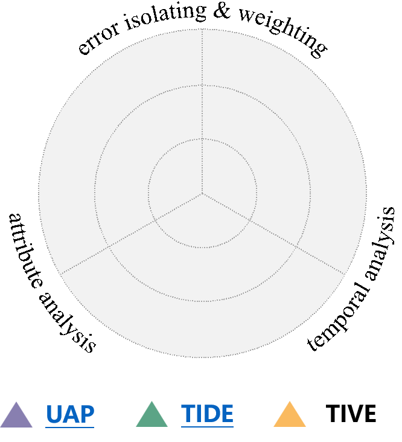
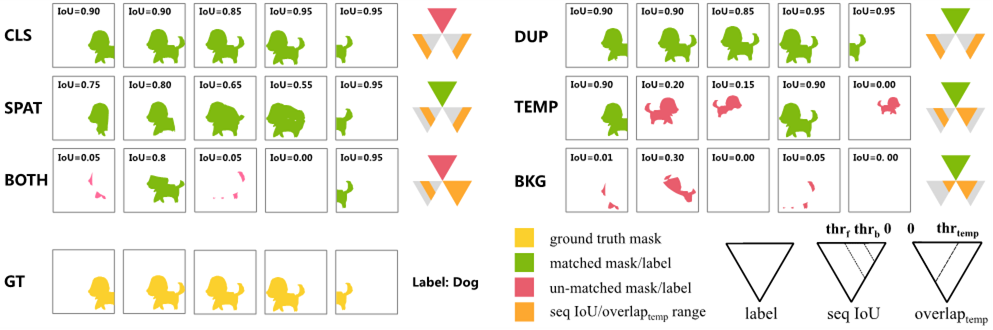

## TIVE

### Abstract

<html>
<style>
    table,tr,td {
        border-top-style: hidden;
        border-bottom-style: hidden;
        border-left-style: hidden;
        border-right-style: hidden;
    }
</style>
<table >
    <tr>
        <td style="width:30%">
            
        </td>
        <td style="width:70%;">
            <font size=5><b>TIVE</b></font> is a Toolbox for Identifying Video instacne segmentation Errors. By directly operating output prediction files, TIVE can isolate error predictions and weight each type’s mAP demage, in purpose of distinguishing model features, as well observe performance over insatcne temporal ranges for real applications. Decomposing localization quality in space-time dimensions, model’s potential drawbacks on spatial segmentation and temporal association can be clearly revealed.

We expect that the analysis of TIVE can give the researchers more insights, guiding the community to promote more meaningful explorations for video instance segmentation.

</td>
</tr>
</table>
</html>

### Error Types



<font size=5><b>TIVE </b></font>bin false positives and false negatives produced by a model into 7 types, including general object recognition errors and two spatial-temporal localization errors with specific focus on spatial segmentation and temporal association quality of predicted mask sequence.

### Error identification

Clear pictures are given to show errors produced by models cross all temporal length, effect of each to the evaluation metric is weighted by individually fixing oracle. Users can observe what prevents their model to achieve higher mAP.

### Citation

If you use TIVE in your project, please cite

```
@inproceedings{jia2022tive,
  author    = {Wenhe Jia and Lu Yang and Zilong Jia and Qing Song},
  title     = {TIVE: A General Toolbox for Identifying Video Instance Segemntation Errors},
  booktitle = {arXiv},
  year      = {2022},
}
```
